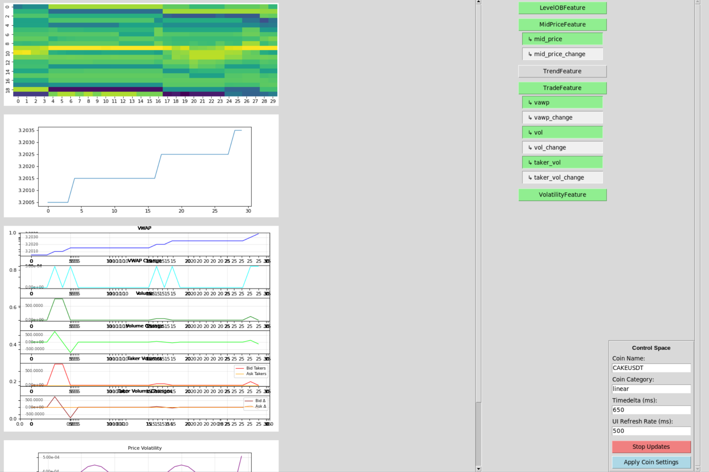
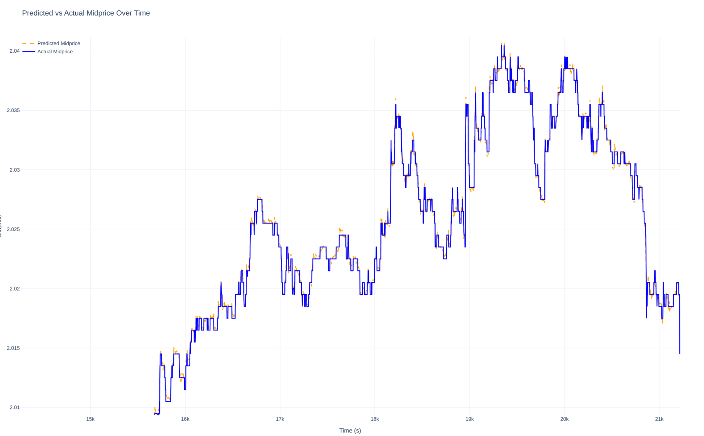

# Python package for experimental Quantiative trading

Fetch data from Bybit API to train models and backtest / mock trade strategies.
Visualize data alongside.


## Usage

First, install the package locally with 
```
    pip install -e .
```

You can now run programs like such:
```
python -m my_ml_crypto_trading.data_processing.InteractiveLiveProcessor
```
which will display a live feed of features extracted from Bybit data, like seen below.  
Note that this program will have difficulties running on MacOS, as it disallows forks.



We have sucessfully trained a model to predict the midprice of CAKEUSDT with a trend accuracy of around 75% (see below).




More documentation to follow.
